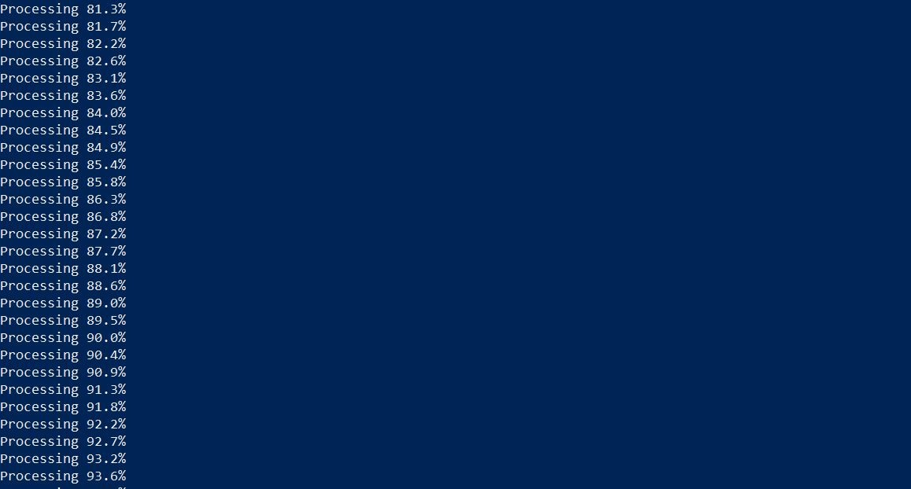

# Fast Online Tracking with Detection Refinement


## About the Project


## Installation

A simple way to setup the repository in the current version on one's local computer is to simply download and unzip the given folder. 

#### Alternative:
To maintain the version with updates(if any), an alternative method can be followed by using forks and clone.

Follow the given steps in sequential order to get a local version of the repository on your computer:

1. Click on the Fork button and select your user account when it asks you where you want to fork the repo.
2. Once you have forked the repo, you will have a copy of it in your account. Navigate to your repo page. The url should look something like this:
```
https://github.com/your-user-name/FastOnlineTracking_Python
```
Now that you have the URL for a repository that you want to copy locally, you can use the terminal to run the git clone command followed by the URL that you copied:

```bash
git clone https://github.com/your-username/FastOnlineTracking_Python
```
You have now made a local copy of a repository under your given parent directory.
## Installing Dependencies
Install all the dependencies mentioned in requirements.txt using the following command:

```bash
cd organized_file_track
pip install requirements.txt
```
#### Note: Do not skip this step as the project needs special libraries and dependencies without which it won't be able to execute properly.

## Running the Demo

ETH-Crossing: ETH videos contain the clips of ETH-Jelmoli, ETH-Linthescher, and ETH-Crossing. For our demo, we make use of the ETH-Crossing video.

ETH videos are full of walking
pedestrians near or far from the camera, so the scale of the appearance model (object box) varies a lot. The size of ETH videos is only 640 × 480 and there are at most 10 detections in each frame. Thus, the speed is very fast and our method can reach real-time performance. 

For these video sequences, the ATH strategy can preserve the loss target and bring them back when they appear again. Other methods may lose the targets which
disappear in detections due to the occlusion and deformation.

To run the demo, run the following commands in your terminal:

```bash
cd organized_file_track
python demo_single_tracker.py
```
If the installation has been done correctly and no major errors are detected, the demo will run with an initial pause of a few seconds displaying the progress as follows:



The demo will run after processing completes and a snapshot of it is displayed below

-->imge
## Contributing
Pull requests are welcome. For major changes, please open an issue first to discuss what you would like to change.

Please make sure to update tests as appropriate.

## License
[MIT](https://choosealicense.com/licenses/mit/)
